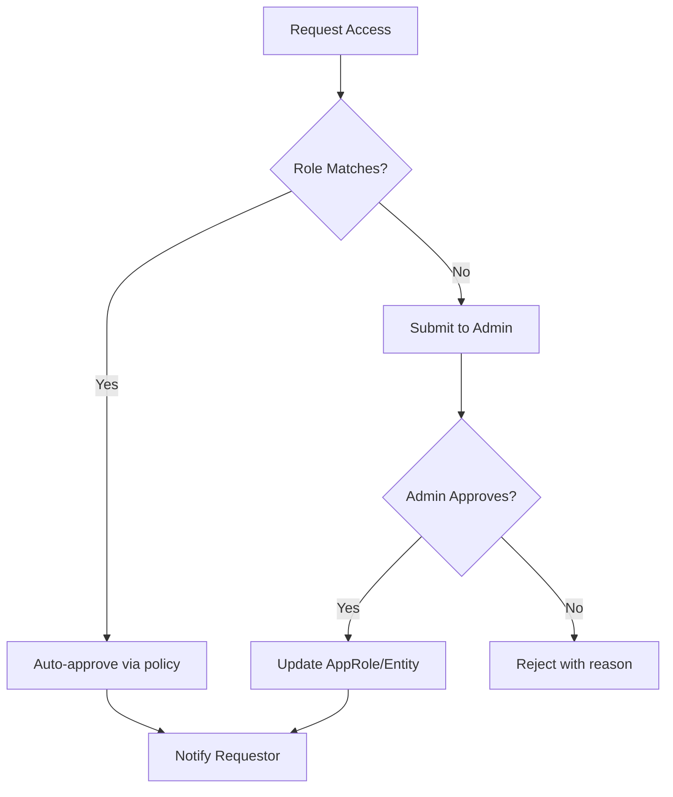

# RBAC to Secret Access Mapping

**Version:** 1.0.0  
**Status:** Active  
**Owner:** Guardian Security Architecture  
**Review Date:** 2026-10-26  
**Classification:** Internal — Security Controlled

---

## 1. Purpose

Map Guardian RBAC roles to Vault policies and secret access permissions. Enforce least-privilege access to secrets based on operational role.

---

## 2. Guardian RBAC Roles (Recap)

| Role | Description | Typical Actors |
|------|-------------|----------------|
| **System** | Automated processes, health checks, schedulers | Guardian Operations, Bridge Dispatcher |
| **Operator** | Day-to-day operations, monitoring, read-only | NOC, SRE on-call |
| **Engineer** | Configuration, secret rotation, debugging | Platform Engineers, DevOps |
| **Admin** | Policy management, vault admin, emergency actions | Security Lead, Platform Lead |
| **Auditor** | Read-only audit, compliance, forensics | Compliance, Security Audit |

---

## 3. Secret Access Matrix

| Secret Category | Path Pattern | System | Operator | Engineer | Admin | Auditor |
|-----------------|--------------|--------|----------|----------|-------|---------|
| **Dynamic DB Credentials** | `database/creds/*` | R | — | R | R | R |
| **Bridge Tokens** | `secret/bridge/*` | RW | — | R | RW | R |
| **API Keys (External)** | `secret/api/*` | R | — | RW | RW | R |
| **Certificates** | `pki/*` | R | — | R | RW | R |
| **Encryption Keys** | `transit/*` | R | — | — | RW | — |
| **Service Accounts** | `secret/svc/*` | R | — | RW | RW | R |
| **Recovery Keys** | `secret/recovery/*` | — | — | — | R | — |
| **Configuration** | `secret/config/*` | R | R | RW | RW | R |
| **Metadata/Inventory** | `secret/metadata/*` | R | R | R | R | R |

**Legend:** R = Read, W = Write, RW = Read/Write, — = No Access

---

## 4. Vault Policy Definitions

### 4.1 System Role (`guardian-system`)

```hcl
# Dynamic database credentials (read-only, short TTL)
path "database/creds/guardian-*"
  capabilities = ["read"]

# Bridge tokens (read/write for rotation)
path "secret/data/bridge/*"
  capabilities = ["create", "read", "update", "delete", "list"]

path "secret/metadata/bridge/*"
  capabilities = ["list", "read"]

# API keys (read for consumers, write for rotation)
path "secret/data/api/*"
  capabilities = ["read"]

# Certificates (read for consumers)
path "pki/issue/guardian-*"
  capabilities = ["create", "read"]

# Config (read for runtime)
path "secret/data/config/*"
  capabilities = ["read"]

# Audit own actions
path "sys/audit"
  capabilities = ["read"]
```

### 4.2 Operator Role (`guardian-operator`)

```hcl
# Read-only access to operational secrets
path "secret/data/config/*"
  capabilities = ["read"]

path "secret/metadata/*"
  capabilities = ["list", "read"]

# Health check: test vault connectivity
path "sys/health"
  capabilities = ["read"]

# View own token info
path "auth/token/lookup-self"
  capabilities = ["read"]
```

### 4.3 Engineer Role (`guardian-engineer`)

```hcl
# Full CRUD on API keys
path "secret/data/api/*"
  capabilities = ["create", "read", "update", "delete", "list"]

path "secret/metadata/api/*"
  capabilities = ["list", "read"]

# Certificate management
path "pki/issue/guardian-*"
  capabilities = ["create", "read", "update"]

path "pki/cert/guardian-*"
  capabilities = ["read", "update"]

# Service accounts
path "secret/data/svc/*"
  capabilities = ["create", "read", "update", "delete", "list"]

# Config management
path "secret/data/config/*"
  capabilities = ["create", "read", "update", "delete", "list"]

# Rotation operations
path "secret/rotate/*"
  capabilities = ["update"]

# Inventory
path "secret/metadata/*"
  capabilities = ["list", "read"]
```

### 4.4 Admin Role (`guardian-admin`)

```hcl
# Full access to all secret paths
path "secret/*"
  capabilities = ["create", "read", "update", "delete", "list", "sudo"]

# Database engine config
path "database/config/*"
  capabilities = ["create", "read", "update", "delete", "list"]

path "database/roles/*"
  capabilities = ["create", "read", "update", "delete", "list"]

# PKI management
path "pki/*"
  capabilities = ["create", "read", "update", "delete", "list", "sudo"]

# Transit (encryption keys)
path "transit/*"
  capabilities = ["create", "read", "update", "delete", "list"]

# Policy management
path "sys/policies/*"
  capabilities = ["create", "read", "update", "delete", "list"]

# Auth methods
path "auth/*"
  capabilities = ["create", "read", "update", "delete", "list"]

# Seal/unseal (emergency)
path "sys/seal*"
  capabilities = ["update"]

# Token management
path "auth/token/*"
  capabilities = ["create", "read", "update", "delete", "list", "sudo"]
```

### 4.5 Auditor Role (`guardian-auditor`)

```hcl
# Read-only access to all secret metadata
path "secret/metadata/*"
  capabilities = ["list", "read"]

# Audit log access
path "sys/audit"
  capabilities = ["read"]

# Health check
path "sys/health"
  capabilities = ["read"]

# Token info (own only)
path "auth/token/lookup-self"
  capabilities = ["read"]

# NO access to secret values
# path "secret/data/*"  # EXPLICITLY DENIED
```

---

## 5. Authentication Methods by Role

| Role | Auth Method | Token TTL | Renewal | Bound CIDR |
|------|-------------|-----------|---------|------------|
| **System** | AppRole | 1 hour | Auto (periodic) | Guardian subnet |
| **Operator** | OIDC (GitHub/Entra ID) | 8 hours | Manual | Corp VPN |
| **Engineer** | OIDC (GitHub/Entra ID) | 8 hours | Manual | Corp VPN |
| **Admin** | OIDC + MFA | 4 hours | Manual | Corp VPN + Bastion |
| **Auditor** | OIDC (ReadOnly group) | 4 hours | Manual | Corp VPN |

---

## 6. AppRole Configuration (System)

```hcl
# guardian-system AppRole
path "auth/approle/role/guardian-system" {
  capabilities = ["read"]
}

# Role configuration
token_policies = ["guardian-system"]
token_ttl = "1h"
token_max_ttl = "4h"
token_period = "1h"  # Allows renewal
bind_secret_id = true
secret_id_ttl = "24h"
secret_id_num_uses = 0  # Unlimited
bound_cidr_list = ["10.0.0.0/8", "172.16.0.0/12"]  # Guardian subnets
```

### 6.1 CI/CD Token Distribution

```powershell
# GitHub Actions: Role ID stored as secret, Secret ID delivered via OIDC
# Workflow:
# 1. GitHub Action authenticates to Vault via OIDC (role: guardian-ci)
# 2. Vault returns wrapped Secret ID for guardian-system role
# 3. Action unwraps and uses Role ID + Secret ID for subsequent calls
# 4. Token auto-renews via period
```

---

## 7. Secret Access Patterns by Operation

| Operation | Role | Secret Path | Policy Check |
|-----------|------|-------------|--------------|
| Health scan | System | `database/creds/*` | Read |
| Bridge dispatch | System | `secret/data/bridge/*` | Read/Write |
| Config reload | System | `secret/data/config/*` | Read |
| Manual rotation | Engineer | `secret/data/api/*` | Read/Write |
| Emergency rotation | Admin | `secret/data/*` | Read/Write/Delete |
| Compliance audit | Auditor | `secret/metadata/*` | Read |
| Certificate renewal | Engineer | `pki/issue/*` | Read/Write |
| Encryption | System | `transit/encrypt/*` | Update |
| Disaster recovery | Admin | `secret/data/recovery/*` | Read |

---

## 8. Access Request Workflow



### 8.1 Emergency Access (Break-Glass)

```powershell
# Admin-only: Generate emergency token with elevated policy
$emergencyToken = New-VaultToken -Policy 'guardian-emergency' `
    -TTL '30m' -DisplayName "Emergency: $reason" `
    -Metadata @{ requestor = $user; reason = $reason }

# Emergency policy grants temporary admin access
# Automatically revoked after TTL, logged to audit
```

---

## 9. Compliance & Audit

### 9.1 Quarterly Access Review

| Review Item | Frequency | Owner |
|-------------|-----------|-------|
| Role membership | Quarterly | Admin |
| Policy effectiveness | Quarterly | Security |
| Unused roles | Quarterly | Admin |
| Emergency token usage | Monthly | Security |

### 9.2 Audit Log Requirements

Every secret access logs:
- `timestamp`, `role`, `entity_id`, `path`, `operation`, `ttl`, `client_ip`

---

## 10. Revision History

| Version | Date | Author | Changes |
|---------|------|--------|---------|
| 1.0.0 | 2026-07-26 | Guardian Security Architecture | Initial release for WQ-002 |

---

*This mapping is enforced by Vault policies. Policy changes require Admin approval and audit log entry.*