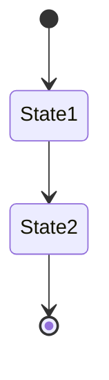
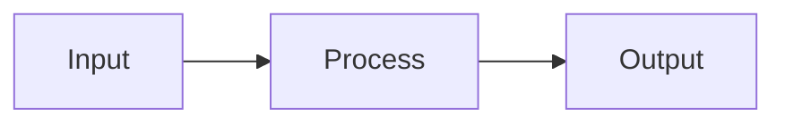

# Template: Architecture Document

**Type:** Architecture Document  
**Status:** Draft  
**Version:** 1.0.0  

---

```yaml
---
title: "[Component/System Name] Architecture"
version: "1.0.0"
status: "Active|Draft|Deprecated"
type: "Architecture"
component: "[Guardian_ModuleName]"
tags:
  - architecture
  - [module-name]
related:
  - "[[Architecture/OVERVIEW]]"
  - "[[Components/[Component]]]"
  - "[[ADR-XXX]]"
  - "[[Features/[Feature]]]"
created: "YYYY-MM-DD"
updated: "YYYY-MM-DD"
owner: "Architect"
review_date: "YYYY-MM-DD"
---
```

---

# [Component/System Name] Architecture

## 1. Purpose
What this component does and why it exists.

## 2. Context
Where this fits in the overall system. Reference [[Architecture/OVERVIEW]].

## 3. Responsibilities
| Responsibility | Description |
|----------------|-------------|
|  |  |

## 4. Public API
### Functions
| Function | Parameters | Returns | Description |
|----------|------------|---------|-------------|
|  |  |  |  |

### Types
| Type | Properties | Description |
|------|------------|-------------|
|  |  |  |

## 5. Dependencies
| Dependency | Type | Version | Purpose |
|------------|------|---------|---------|
|  | Internal/External |  |  |

## 6. State Model
### State Stores
| Store | Format | Retention | Access Pattern |
|-------|--------|-----------|----------------|
|  |  |  |  |

### State Transitions


## 7. Data Flow


## 8. Failure Modes
| Scenario | Detection | Recovery | Impact |
|----------|-----------|----------|--------|
|  |  |  |  |

## 9. Security Considerations
| Threat | Mitigation |
|--------|------------|
|  |  |

## 10. Performance Targets
| Metric | Target | Measurement |
|--------|--------|-------------|
|  |  |  |

## 11. Testing Strategy
| Test Type | Coverage | Tools |
|-----------|----------|-------|
| Unit |  | Pester |
| Integration |  | Pester |
| Contract |  | JSON Schema |
| Chaos |  |  |

## 12. Operational Procedures
| Procedure | Trigger | Steps |
|-----------|---------|-------|
|  |  |  |

## 13. Related Documents
- [[ADR-XXX]]
- [[Components/[Component]]]
- [[Features/[Feature]]]

---

*Template Version: 1.0.0*